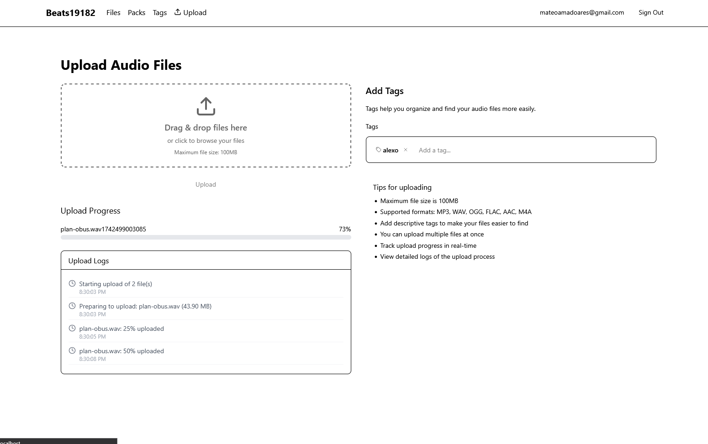
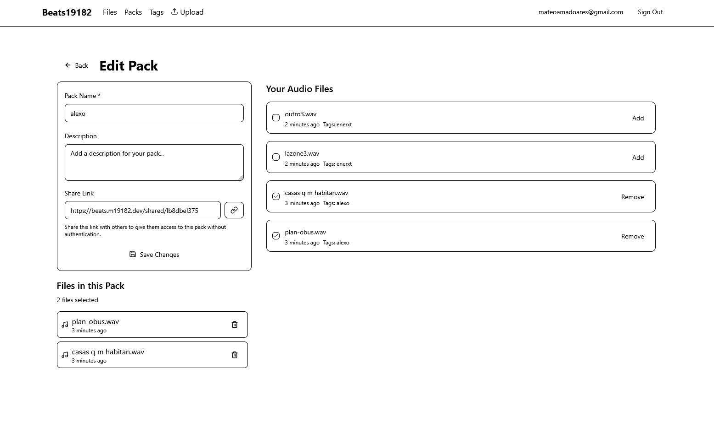
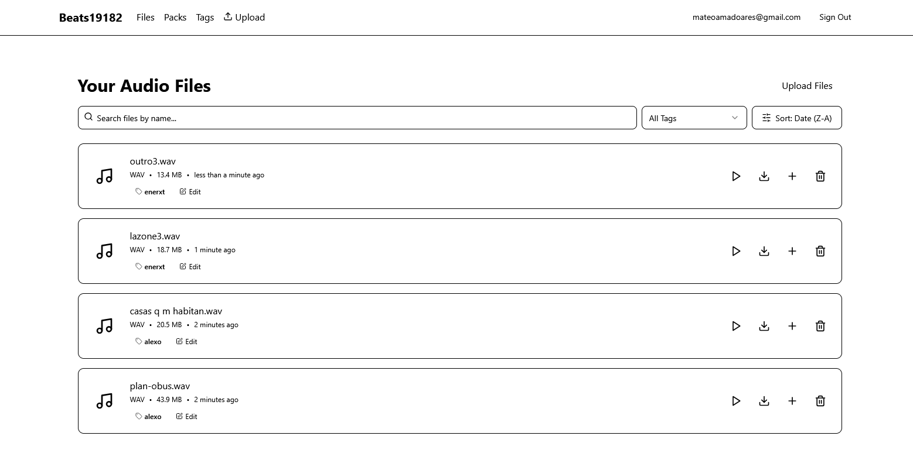

# Beats19182 - Offtop Alternative

This application is designed as an alternative to [OffTop](https://offtop.com/) with full control over their data. 

## Overview
Self-hosted platform for managing and sharing audio files with a structured tagging system. It allows users to upload files, organize them with tags, and create packs for easy sharing. The entire system runs on a local server without reliance on cloud services.

## Screenshots

## Setup and Configuration

create a .env file and set the variables in docker-compose.yml
run docker compose up

## TODO

- change name from files page
- global player should be closed not minimized, also fix
- actual sort by date and get from date from tags
- get rid of all the random text 
- complete uploads with gente: cxx, yl, ... and new beats
- public facing page with my music
- actually good UI
- images for covers
- bpm and key ? automatic recgnition
- User activity logging
- API for external integrations
- mobile version
- Dark mode
- visualizer

## Features

### File Management
- Users can upload various file types and store them securely using MinIO (S3-compatible object storage).
- File metadata (name, type, size, etc.) is stored in a PostgreSQL database.
- Secure access controls ensure only authorized users can manage files.

### Tagging System
- Users can create and assign multiple tags to files.
- Tag-based filtering and search enable quick retrieval of relevant files.
- Smart suggestions for frequently used tags improve organization.

### Versioning
- Automatic version tracking for file updates
- Access to previous versions of files

### Pack Creation & Sharing
- Users can group multiple files into "packs."
- Packs can be shared with unique links.

## Tech Stack
- **Frontend:** Next.js (App Router), Tailwind CSS, shadcn/ui
- **Database:** PostgreSQL (via Prisma ORM)
- **Storage:** MinIO (S3-compatible object storage)
- **Auth:** NextAuth.js (JWT-based authentication)
